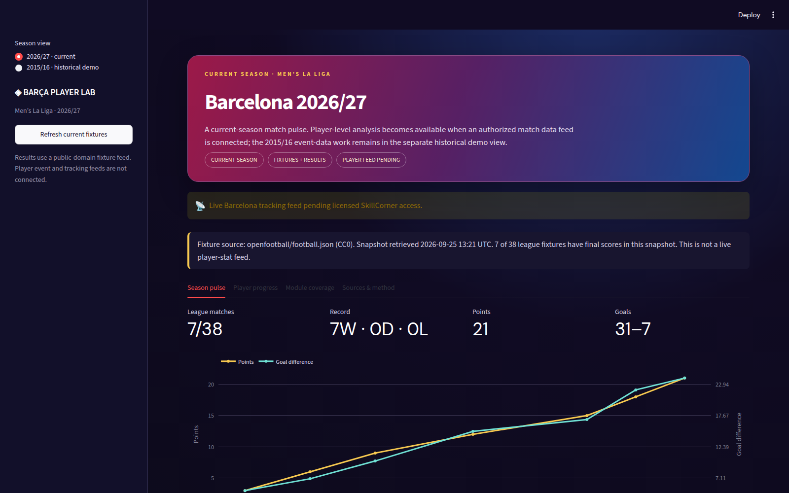

# Barça Player Lab



A Barcelona analytics dashboard built with Streamlit and Plotly. **The default view is the current men’s 2026/27 La Liga season.** It shows real fixtures and results from a public-domain source. Player progress can use a locally uploaded, authorized player-match CSV. Detailed event-data analysis is available in a separately labelled **2015/16 historical demo**; it is not presented as current Barcelona performance.

> **Live Barcelona tracking feed pending licensed SkillCorner access.** No current Barcelona tracking, licensed footage, live data, or medical data is included.

## Current 2026/27 season

The default dashboard view uses [openfootball/football.json](https://github.com/openfootball/football.json) [CC0](https://github.com/openfootball/football.json/blob/master/LICENSE.md) La Liga fixtures and scores. The checked-in snapshot has 38 scheduled league fixtures and 7 final scores as of 25 September 2026. Use **Refresh current fixtures** in the sidebar, or run:

```bash
python scripts/build_current_fixtures.py
```

The source does not guarantee a daily upstream update and contains **no player event or tracking data**. The current-season player page therefore accepts an authorized CSV in your local browser session. Download the header-only template in the app or use [`examples/current_player_match_template.csv`](examples/current_player_match_template.csv). Required columns are `matchday,date,player,minutes`; supported optional columns are `goals,assists,xg,xa,passes,progressive_passes,pressures,recoveries,interceptions,tackles`. Include a numeric value, including zero, for every row of a metric you supply. The app validates season dates, completed matchdays, duplicate player-match rows and nonnegative values. Uploads are not written to disk or GitHub.

With authorized player rows, the current view calculates cumulative per-90 progress and minutes. Same-role Europe benchmarks, game-state splits, pass maps and Barcelona off-ball movement remain **pending a licensed current-season feed**. A matchday final-season forecast also remains pending validated current player observations and suitable training data. The 2015/16 data is never inserted into current-season player charts or presented as a current prediction.

## Historical 2015/16 demo coverage

## Coverage and source separation

| Source | Competition and season | Dashboard use | Published club fixtures in this build |
| --- | --- | --- | ---: |
| StatsBomb Open Data | Men’s La Liga 2015/16 | Barcelona player analysis | Barcelona 38 |
| StatsBomb Open Data | Men’s Premier League 2015/16 | Same-role peer panel | Arsenal 38 |
| StatsBomb Open Data | Men’s Serie A 2015/16 | Same-role peer panel | Juventus 38 |
| StatsBomb Open Data | Men’s Ligue 1 2015/16 | Same-role peer panel | Paris Saint-Germain 37 |
| StatsBomb Open Data | Men’s Bundesliga 2015/16 | Same-role peer panel | Bayer Leverkusen 34 |
| SkillCorner Open Data | 2024/25 A-League, Auckland FC vs Newcastle United Jets FC, 30 November 2024 | Separate 10-minute tracking prototype | One excerpt |

The historical panel contains **185 selected-club matches**, 2,552 player-match appearances, and 114,744 pass events processed into compact spatial aggregates. It is a **curated five-club comparison**, not a full European-league distribution. The published StatsBomb Ligue 1 catalog has 37 PSG fixtures here, leaving one fixture gap; the Bundesliga catalog provides Leverkusen’s 34 fixtures, not the entire league. Source coverage can change when the upstream repository changes. The SkillCorner match is unrelated to every StatsBomb fixture and is never joined to Barcelona data. Sample players are shown with anonymized display labels.

## Run locally

Use Python 3.11 or later:

```bash
python -m venv .venv
source .venv/bin/activate
pip install -r requirements.txt
streamlit run app.py
```

The repository includes the current fixture snapshot and small historical **derived** CSVs, so the dashboard runs immediately. To rebuild from public sources, with network access:

```bash
python scripts/build_data.py --workers 8
python scripts/build_tracking_sample.py
python scripts/build_current_fixtures.py
pytest -q
streamlit run app.py
```

The historical scripts stream or download source JSON in memory, write only aggregated outputs to `data/derived/`, and do not persist raw event or tracking files. The current fixture script stores the small CC0 snapshot at `data/current/fixtures.json`. Compact manifests record source, season, match counts and demo status. No credentials or paid account are required.

## Historical analytics methodology

- **Playing time:** Starting XI players begin at minute zero; substitutes start or exit at their substitution time; dismissals end their minutes. Match end is the final second-period event, floored at 90 minutes and capped at 110. Minutes are estimates and include observed stoppage time.
- **Broad role:** dominant minutes played as goalkeeper, defender, midfielder or forward. The same-role peer median includes non-Barcelona players with at least 900 minutes in the four selected comparison clubs. This controls only broad role and exposure, not team style, match strength or possession.
- **Per 90:** `90 × event count ÷ estimated minutes`. Cumulative season progress and five-appearance form use total events over total minutes, rather than an unweighted average of match rates.
- **xG and xA:** xG is StatsBomb’s provided shot value. xA is the xG of a shot linked by StatsBomb’s `assisted_shot_id` to a pass; unlinked chances do not receive xA here.
- **Progressive pass/carry proxy:** completed pass or carry with at least 12 StatsBomb pitch x-units forward and an endpoint at x≥60 on a 120×80 pitch. Final-third entry is a completed pass crossing from x<80 to x≥80. This simple definition is displayed in the app.
- **Quiet Contribution Finder:** `(recoveries + interceptions + 0.5×pressures + progressive passes + progressive carries) × 90 ÷ minutes`, restricted to Barcelona outfield players with at least 450 minutes. The components overlap in football meaning and should not be interpreted as player value.
- **Game state:** each event is labelled Leading, Level or Trailing using the score immediately before it. Own goals are assigned to the opponent. State charts show event volumes because this compact export does not calculate state-specific on-pitch minutes.
- **Risk–reward passing:** the risk proxy counts a pass from x≥60 to x≥80 with a through-ball flag or at least 15 x-units of advance. Reward counts a completed progressive or shot-assist pass. These are descriptive and can overlap; neither is an expected-value model. The pitch uses 20×20 pass-origin counts, not raw event records.
- **Off-ball sample:** SkillCorner positions are sampled every two seconds over the first ten minutes of period one. Only detected points are used. Movement steps implying more than 10 m/s are filtered; the distance is an illustrative partial path, not an official physical output. Display coordinates are projected from the sample’s 105×68m pitch to the 120×80 graphic.

## Findings in the historical sample

- Luis Suárez accumulated roughly **27.6 xG** and **10.7 linked-pass xA** in 3,243 estimated league minutes. His xG pace was about **0.77 per 90**, versus **0.40 per 90** for the selected-club forward peer median.
- Andrés Iniesta led eligible Barcelona outfield players on the defined quiet-action index at **31.15 per 90**. Javier Mascherano recorded **27.37 per 90** with no goals or assists, illustrating why the index surfaces players whose work a scoreline misses.
- These findings describe the supplied 2015/16 open-data panel. They do not indicate current form, future performance, or scouting-grade ranking.

## Credits, terms and limits

**Event data source: StatsBomb.** The dashboard displays the StatsBomb logo from the [StatsBomb Open Data repository](https://github.com/hudl/open-data/tree/master/img). StatsBomb’s [open-data terms](https://github.com/hudl/open-data#terms--conditions) require source attribution and logo use for published analysis; the source [media pack](https://statsbomb.com/media-pack/) is linked as well. The repo includes only compact derived aggregates, not StatsBomb’s raw match/event JSON.

**Current fixture source: openfootball/football.json.** Its [CC0 license](https://github.com/openfootball/football.json/blob/master/LICENSE.md) permits the checked-in snapshot. It contains scores and fixtures only and may lag completed matches until the upstream Football.TXT source changes.

**Tracking sample source: SkillCorner Open Data.** The source [repository](https://github.com/SkillCorner/opendata) is [MIT licensed](https://github.com/SkillCorner/opendata/blob/master/LICENSE). This project retains the source credit, only publishes a small derived, anonymized display excerpt, and keeps it separate from Barcelona analysis. Tracking has detection and identity limitations noted in SkillCorner’s README.

This is an independent analytical demo and is not affiliated with FC Barcelona, StatsBomb or SkillCorner. Future live Barcelona off-ball features require an appropriately licensed tracking feed and are **pending**.
